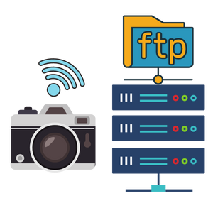
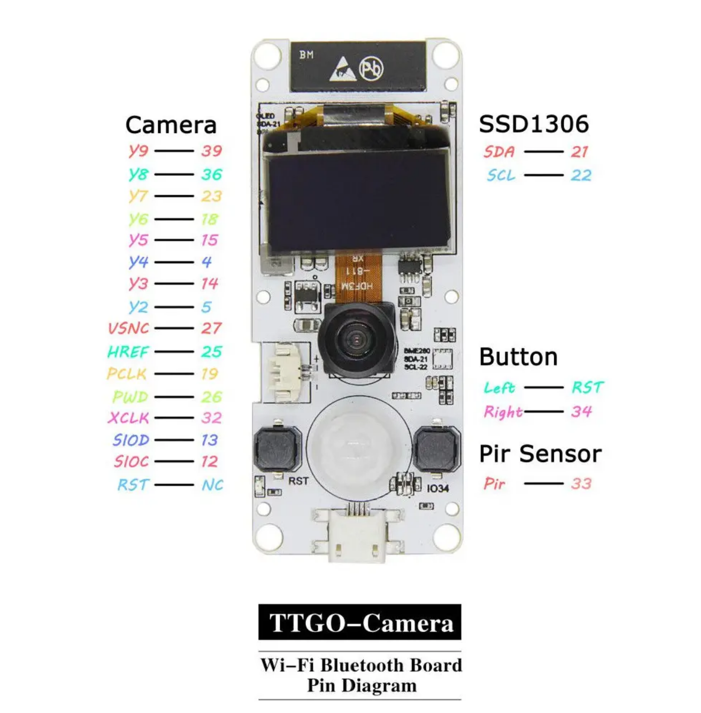

<p align="center">
  <a href="" rel="noopener">
 </a>
</p>

<h3 align="center">ESP32 CAM FTP Image Uploader</h3>

<div align="center">

[]()

</div>

---

<p align="center"> ESP32 CAM FTP Image Uploader
    <br> 
</p>

## 📝 Table of Contents

- [About](#about)
- [Getting Started](#getting_started)
- [Circuit](#circuit)
- [Usage](#usage)
- [List Of Components](#list)
- [Built Using](#built_using)
- [Authors](#authors)

## 🧐 About <a name = "about"></a>

This repo contains

- Firmware
- Detailed instructions

for ESP32 CAM FTP Image Uploader.

## Getting Started <a name = "getting_started"></a>

These instructions will get you a copy of the project up and running on your system.

### Prerequisites

Things you need to install the FW.

```
- Arduino IDE
```

### Installing <a name = "installing"></a>

A step by step series that tell you how to get the Firmware and Backend running

#### ESP32 Configuration

You should have Arduino IDE Installed

1.  Add ESP32 Board to your Arduino IDE
1.  In your Arduino IDE, go to File> Preferences
    Installing ESP32 Add-on in Arduino IDE Windows, Mac OS X, Linux open preferences
1.  Enter `https://dl.espressif.com/dl/package_esp32_index.json`
    into the “Additional Board Manager URLs” field then, click the “OK” button:
    Note: if you already have the ESP32 boards URL, you can separate the URLs with a comma(each board will go to neaw line) as follows:
    `https://dl.espressif.com/dl/package_esp32_index.json,\n http://arduino.esp8266.com/stable/package_esp8266com_index.json`

1.  Open the Boards Manager. Go to Tools > Board > Boards Manager…
1.  Search for ESP32 and press install button for the ESP32 by Espressif Systems“:
1.  That’s it. It should be installed after a few seconds.
2.  Close and re-open the Arduino IDE.

3.  Now copy the contents of the libs folder to the libraries directory of your Arduino
    1. If you are using windows, the libraries directory will be Documents/Arduino/libraries

##### ESP32 Node FW Uploading

1.  Select ESP32 Dev Module from Tools->Board->ESP32
2.  Select the correct port from Tools->Port
3.  Then open Firmware.ino file,
4.  Select Tools > ESP32 Sketch Data Upload menu item. This should start uploading the files into ESP32 flash file system.
5.  Now Upload the Code to your ESP32 Dev Module.
6.  Your ESP32 is now ready to be used.

## Circuit <a name = "circuit"></a>

### ESP32 Dev Module Pinout

Follow the pinout diagram given below to connect different components to your ESP32 Dev Module board.




## Usage <a name = "usage"></a>

1.  Open Firmware folder and open ftpServerCreds.h file.
2.  Put your FTP server credentials on line number 20, 21 and 22.
3.  Open Firmware.ino file and put your WiFi credentials on line number 34 and 34.
4.  Upload the code to your ESP32.
5.  When PIR sensor detect a motion, it will take the image and will upload it to the FTP server with timestamp.

## List of Components <a name = "list"></a>

Following components are used to make this project

1.  ESP32 Cam
    ○ https://www.banggood.com/LILYGO-TTGO-T-Camera-ESP32-WROVER-with-PSRAM-Camera-Module-OV2640-Camera-0_96-Inch-OLED-p-1418433.html?akmClientCountry=PL&cur_warehouse=CN&ID=566074

## ⛏️ Built Using <a name = "built_using"></a>


- [Arduino](https://www.arduino.cc/) - Embedded Framework and IDE - For Sensor Node Design


## ✍️ Authors <a name = "authors"></a>

- [@Nauman3S](https://github.com/Nauman3S) - Development and Deployment
